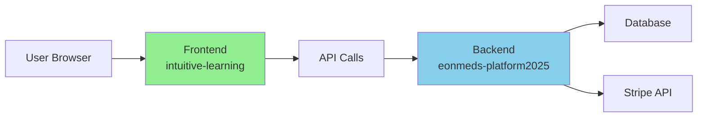

# FRONTEND VS BACKEND - CRITICAL DEPLOYMENT GUIDE

## 🚨 NEVER FORGET: These are TWO SEPARATE Services!

Last Updated: August 16, 2025

---

## 🖥️ FRONTEND (What Users See)

### Service Details:
- **Railway Service Name**: `intuitive-learning`
- **Live URL**: https://intuitive-learning-production.up.railway.app
- **Local URL**: http://localhost:3000
- **Location**: `/packages/frontend/`
- **Technology**: React, TypeScript, CSS
- **Build Command**: `npm run build`
- **Deploy Command**: `railway service intuitive-learning && railway up`

### What Lives Here:
- ✅ All UI components (buttons, forms, modals)
- ✅ Pages users navigate to
- ✅ Billing dashboard UI
- ✅ Invoice creation forms
- ✅ Payment interfaces
- ✅ Navigation menus
- ✅ CSS styling
- ✅ User authentication UI

### Key Files:
```
packages/frontend/
├── src/
│   ├── App.tsx                    # Main app with routes
│   ├── components/
│   │   ├── billing/              # ALL BILLING UI COMPONENTS
│   │   ├── layout/
│   │   │   └── AppLayout.tsx     # Sidebar with menu items
│   │   └── patients/
│   ├── pages/
│   │   ├── BillingDashboard.tsx  # Main billing page
│   │   └── Dashboard.tsx
│   └── services/
│       └── api.service.ts        # Calls to backend
```

### How to Test Frontend Locally:
```bash
cd packages/frontend
npm install
npm run start
# Opens at http://localhost:3000
# Check:
# - Can you see Billing Center in menu?
# - Does /billing route work?
# - Do components render?
```

### How to Deploy Frontend:
```bash
# Method 1: Railway CLI
railway service intuitive-learning
railway up

# Method 2: Railway Dashboard
# 1. Go to Railway dashboard
# 2. Click on "intuitive-learning" service
# 3. Click "Redeploy"
```

---

## ⚙️ BACKEND (API & Database)

### Service Details:
- **Railway Service Name**: `eonmeds-platform2025`
- **Live URL**: https://eonmeds-platform2025-production.up.railway.app
- **Local URL**: http://localhost:8080
- **Location**: `/packages/backend/`
- **Technology**: Node.js, Express, TypeScript
- **Build Command**: `npm run build`
- **Deploy Command**: `railway service eonmeds-platform2025 && railway up`

### What Lives Here:
- ✅ API endpoints (/api/v1/...)
- ✅ Database connections
- ✅ Stripe integration
- ✅ Business logic
- ✅ Authentication logic
- ✅ Invoice generation
- ✅ Payment processing
- ✅ Webhook handlers

### Key Files:
```
packages/backend/
├── src/
│   ├── index.ts                   # Server entry point
│   ├── controllers/
│   │   ├── billing.controller.ts  # Billing API endpoints
│   │   └── stripe-webhook.controller.ts
│   ├── services/
│   │   ├── billing-system.service.ts
│   │   └── stripe.service.ts
│   └── routes/
│       └── billing.routes.ts
```

### How to Test Backend Locally:
```bash
cd packages/backend
npm install
npm run dev
# Runs at http://localhost:8080
# Test:
curl http://localhost:8080/api/v1/health
curl http://localhost:8080/api/v1/billing/invoices
```

### How to Deploy Backend:
```bash
# Method 1: Railway CLI
railway service eonmeds-platform2025
railway up

# Method 2: Git push (auto-deploys)
git push origin main
```

---

## 🔄 HOW THEY WORK TOGETHER



### Communication Flow:
1. User clicks "Create Invoice" in **Frontend**
2. Frontend calls `POST /api/v1/billing/invoices` on **Backend**
3. Backend processes request, talks to Stripe
4. Backend returns response to Frontend
5. Frontend shows success/error to user

---

## ✅ TESTING CHECKLIST BEFORE DEPLOYMENT

### Frontend Testing:
```bash
# 1. Start frontend locally
cd packages/frontend
npm run start

# 2. Check these manually:
□ Homepage loads without errors
□ Can navigate to /billing
□ Billing dashboard renders
□ No console errors in browser
□ API calls point to correct backend URL
□ Build succeeds: npm run build
```

### Backend Testing:
```bash
# 1. Start backend locally
cd packages/backend
npm run dev

# 2. Test API endpoints:
□ GET /api/v1/health returns 200
□ GET /api/v1/billing/invoices works
□ TypeScript builds: npm run build
□ No TypeScript errors
□ Stripe webhook endpoint accessible
```

### Integration Testing:
```bash
# Run both frontend and backend locally
# Frontend: http://localhost:3000
# Backend: http://localhost:8080

□ Frontend can call backend APIs
□ Create invoice flow works end-to-end
□ Authentication works
□ No CORS errors
```

---

## 🚨 COMMON MISTAKES TO AVOID

### ❌ DON'T:
1. Fix backend when UI isn't changing (wrong service!)
2. Deploy without testing locally first
3. Assume one deployment updates both services
4. Forget to check WHICH service failed

### ✅ DO:
1. Always identify which service has the issue
2. Test locally before deploying
3. Deploy the correct service
4. Check deployment logs for the RIGHT service

---

## 📝 DEPLOYMENT COMMANDS REFERENCE

### Check What Services Exist:
```bash
railway service
```

### Deploy Frontend Only:
```bash
railway service intuitive-learning
railway up
```

### Deploy Backend Only:
```bash
railway service eonmeds-platform2025
railway up
# OR just: git push origin main
```

### Deploy Both:
```bash
# Terminal 1
railway service intuitive-learning
railway up

# Terminal 2
railway service eonmeds-platform2025
railway up
```

---

## 🎯 QUICK DIAGNOSIS GUIDE

### "I don't see my UI changes"
- **Issue**: Frontend not deployed
- **Fix**: Deploy frontend service
- **Check**: https://intuitive-learning-production.up.railway.app

### "API returns 404"
- **Issue**: Backend route doesn't exist
- **Fix**: Check backend routes and deploy
- **Check**: https://eonmeds-platform2025-production.up.railway.app/api/v1/...

### "TypeScript errors in build"
- **Issue**: Code has type errors
- **Fix**: Run `npm run build` locally first
- **Never**: Deploy without fixing locally

### "Stripe webhooks failing"
- **Issue**: Backend webhook endpoint issue
- **Fix**: Check backend logs and webhook secret
- **Endpoint**: /api/v1/webhooks/stripe

---

## 🔑 ENVIRONMENT VARIABLES

### Frontend (.env):
```
REACT_APP_API_URL=https://eonmeds-platform2025-production.up.railway.app
REACT_APP_AUTH0_DOMAIN=xxx
REACT_APP_AUTH0_CLIENT_ID=xxx
```

### Backend (.env):
```
DATABASE_URL=postgresql://...
STRIPE_SECRET_KEY=sk_live_...
STRIPE_WEBHOOK_SECRET=whsec_...
JWT_SECRET=xxx
PORT=8080
```

---

## 📊 CURRENT STATUS (August 16, 2025)

### Frontend:
- ❌ Not deployed with latest changes
- ❌ Missing billing UI components
- ❌ Showing old invoice system

### Backend:
- ✅ Successfully deployed
- ✅ All TypeScript errors fixed
- ✅ API endpoints working
- ✅ Stripe integration ready

### Next Action Required:
**DEPLOY FRONTEND SERVICE to see billing features!**
