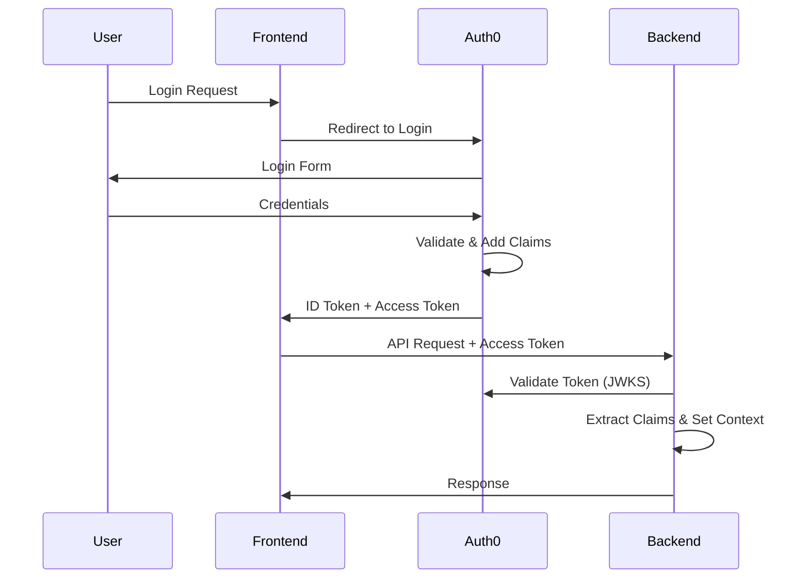

# 🔐 SECURITY MODEL - EONPRO/PHARMAX PLATFORM

**Document Version**: 1.0  
**Last Updated**: January 7, 2025  
**Classification**: CONFIDENTIAL  

---

## OVERVIEW

This document defines the comprehensive security model for the EONPro/PHARMAX multi-tenant EHR/Pharmacy platform, including RBAC (Role-Based Access Control), ABAC (Attribute-Based Access Control), and tenant isolation mechanisms.

---

## 🎭 ROLE-BASED ACCESS CONTROL (RBAC)

### System Roles Hierarchy

```
platform_admin (Super Admin)
    ├── practice_admin (Tenant Admin)
    │   ├── provider (Clinical)
    │   ├── pharmacy (Pharmacy)
    │   └── staff (Administrative)
    ├── patient (Self-Service)
    └── auditor (Read-Only)
```

### Role Definitions

#### 1. PLATFORM_ADMIN
- **Purpose**: System-wide administration
- **Tenant Access**: ALL
- **Permissions**:
  - `system:*` - All system operations
  - `tenant:create|read|update|delete`
  - `user:create|read|update|delete|impersonate`
  - `config:*` - System configuration
  - `audit:read|export`
  - `billing:*` - Platform billing

#### 2. PRACTICE_ADMIN
- **Purpose**: Tenant-level administration
- **Tenant Access**: Own tenant only
- **Permissions**:
  - `tenant:read|update` - Own tenant only
  - `user:create|read|update|delete` - Within tenant
  - `provider:create|read|update|delete`
  - `patient:create|read|update|delete`
  - `billing:read|update` - Tenant billing
  - `report:*` - All reports for tenant
  - `config:read|update` - Tenant configuration

#### 3. PROVIDER
- **Purpose**: Clinical operations
- **Tenant Access**: Own tenant only
- **Permissions**:
  - `patient:read|update` - Assigned patients
  - `prescription:create|read|update|void`
  - `soap_note:create|read|update`
  - `medical_record:read|update`
  - `appointment:create|read|update|delete`
  - `lab:order|read`
  - `referral:create|read`

#### 4. PHARMACY
- **Purpose**: Pharmacy operations
- **Tenant Access**: Own tenant only
- **Permissions**:
  - `prescription:read|fill|verify`
  - `patient:read` - Limited PHI
  - `medication:read|update|inventory`
  - `refill:approve|deny`
  - `interaction:check`
  - `insurance:verify`

#### 5. STAFF
- **Purpose**: Administrative support
- **Tenant Access**: Own tenant only
- **Permissions**:
  - `patient:create|read|update`
  - `appointment:create|read|update|delete`
  - `billing:create|read|update`
  - `insurance:read|update|verify`
  - `document:upload|read`
  - `report:read` - Limited reports

#### 6. PATIENT
- **Purpose**: Self-service portal
- **Tenant Access**: Own records only
- **Permissions**:
  - `profile:read|update` - Own profile
  - `appointment:read|request` - Own appointments
  - `prescription:read` - Own prescriptions
  - `medical_record:read` - Own records
  - `billing:read|pay` - Own bills
  - `message:create|read` - With providers

#### 7. AUDITOR
- **Purpose**: Compliance and audit
- **Tenant Access**: Assigned tenants
- **Permissions**:
  - `*:read` - Read-only access to assigned resources
  - `audit:read|export`
  - `report:read|generate`
  - `log:read`
  - NO write permissions

---

## 🏢 ATTRIBUTE-BASED ACCESS CONTROL (ABAC)

### Core Attributes

#### User Attributes
```typescript
interface UserAttributes {
  user_id: string;
  tenant_id: string;
  org_id?: string;
  department?: string;
  location?: string;
  license_number?: string;
  license_state?: string;
  specialties?: string[];
  clearance_level?: 1 | 2 | 3 | 4 | 5;
}
```

#### Resource Attributes
```typescript
interface ResourceAttributes {
  resource_id: string;
  resource_type: string;
  tenant_id: string;
  owner_id?: string;
  department?: string;
  sensitivity_level?: 'public' | 'internal' | 'confidential' | 'restricted';
  phi_flag: boolean;
  creation_date: Date;
  last_accessed?: Date;
}
```

#### Environmental Attributes
```typescript
interface EnvironmentAttributes {
  time: Date;
  ip_address: string;
  location?: string;
  device_type?: string;
  network_zone?: 'internal' | 'dmz' | 'external';
  mfa_verified: boolean;
  session_age: number;
}
```

### ABAC Policies

#### Policy 1: PHI Access Control
```javascript
{
  "id": "phi-access-policy",
  "effect": "ALLOW",
  "condition": {
    "AND": [
      { "user.tenant_id": "==", "resource.tenant_id" },
      { "user.clearance_level": ">=", "3" },
      { "resource.phi_flag": "==", true },
      { "environment.mfa_verified": "==", true },
      { "environment.network_zone": "IN", ["internal", "dmz"] }
    ]
  }
}
```

#### Policy 2: Cross-Department Access
```javascript
{
  "id": "cross-department-policy",
  "effect": "DENY",
  "condition": {
    "AND": [
      { "user.department": "!=", "resource.department" },
      { "user.role": "NOT_IN", ["practice_admin", "platform_admin"] }
    ]
  }
}
```

#### Policy 3: Time-Based Access
```javascript
{
  "id": "business-hours-policy",
  "effect": "ALLOW",
  "condition": {
    "OR": [
      { "user.role": "IN", ["provider", "pharmacy"] },
      {
        "AND": [
          { "environment.time.hour": ">=", 7 },
          { "environment.time.hour": "<=", 19 }
        ]
      }
    ]
  }
}
```

---

## 🏛️ TENANT ISOLATION MODEL

### Database Isolation

#### Strategy: Row-Level Security with Composite Keys
```sql
-- Every table includes tenant_id
CREATE TABLE patients (
  id UUID DEFAULT gen_random_uuid(),
  tenant_id UUID NOT NULL,
  -- ... other fields
  PRIMARY KEY (tenant_id, id),
  FOREIGN KEY (tenant_id) REFERENCES tenants(id)
);

-- Row-level security policy
CREATE POLICY tenant_isolation ON patients
  FOR ALL
  USING (tenant_id = current_setting('app.tenant_id')::uuid);
```

### API Isolation

#### Middleware Enforcement
```typescript
class TenantIsolationMiddleware {
  async enforce(req: Request, res: Response, next: NextFunction) {
    const tenantId = req.auth.tenant_id;
    
    // Set tenant context for database
    await db.query('SET LOCAL app.tenant_id = $1', [tenantId]);
    
    // Add to request context
    req.context = {
      tenant_id: tenantId,
      user_id: req.auth.sub,
      role: req.auth.role
    };
    
    // Validate cross-tenant requests
    if (req.params.tenant_id && req.params.tenant_id !== tenantId) {
      if (!req.auth.permissions.includes('tenant:cross_access')) {
        throw new ForbiddenError('Cross-tenant access denied');
      }
    }
    
    next();
  }
}
```

### Storage Isolation

#### S3 Bucket Structure
```
s3://eonpro-platform/
  ├── tenants/
  │   ├── {tenant_id}/
  │   │   ├── documents/
  │   │   ├── images/
  │   │   ├── reports/
  │   │   └── backups/
  └── platform/
      ├── logs/
      └── configs/
```

#### IAM Policy for Tenant Isolation
```json
{
  "Version": "2012-10-17",
  "Statement": [
    {
      "Effect": "Allow",
      "Action": ["s3:GetObject", "s3:PutObject"],
      "Resource": "arn:aws:s3:::eonpro-platform/tenants/${jwt:tenant_id}/*",
      "Condition": {
        "StringEquals": {
          "s3:x-amz-server-side-encryption": "AES256"
        }
      }
    }
  ]
}
```

---

## 🔑 AUTHENTICATION FLOW

### 1. Initial Authentication


### 2. Token Claims Structure
```json
{
  "iss": "https://your-domain.auth0.com/",
  "sub": "auth0|user_id",
  "aud": "https://api.eonpro.com",
  "exp": 1234567890,
  "iat": 1234567890,
  "https://eonpro.com/tenant_id": "tenant_uuid",
  "https://eonpro.com/org_id": "org_uuid",
  "https://eonpro.com/role": "provider",
  "https://eonpro.com/permissions": [
    "patient:read",
    "prescription:create"
  ],
  "https://eonpro.com/clearance_level": 3
}
```

### 3. Session Management
- **Access Token TTL**: 15 minutes
- **Refresh Token TTL**: 7 days (with rotation)
- **Absolute Session**: 12 hours
- **Idle Timeout**: 30 minutes
- **MFA Required**: For sensitive operations

---

## 🛡️ PERMISSION MATRIX

| Resource | Platform Admin | Practice Admin | Provider | Pharmacy | Staff | Patient | Auditor |
|----------|---------------|----------------|----------|----------|-------|---------|---------|
| System Config | CRUD | R | - | - | - | - | R |
| Tenant Config | CRUD | RU | R | R | R | - | R |
| Users | CRUD | CRUD* | R | - | R | - | R |
| Patients | CRUD | CRUD | RU* | R* | CRU | R† | R |
| Prescriptions | CRUD | CRUD | CRU | RU | R | R† | R |
| SOAP Notes | CRUD | CRUD | CRU | - | R | R† | R |
| Billing | CRUD | CRUD | R | - | CRU | R† | R |
| Reports | CRUD | CRUD | R* | R* | R* | - | R |
| Audit Logs | R | R | - | - | - | - | R |

**Legend**:
- C: Create
- R: Read  
- U: Update
- D: Delete
- *: Limited to assigned/relevant records
- †: Own records only
- -: No access

---

## 🔒 SECURITY CONTROLS

### 1. Defense in Depth
- **Network**: WAF, DDoS protection, VPC isolation
- **Application**: Input validation, parameterized queries, CSP headers
- **Data**: Encryption at rest (AES-256), in transit (TLS 1.3)
- **Identity**: MFA, passwordless options, biometric support

### 2. Zero Trust Principles
- Never trust, always verify
- Least privilege access
- Assume breach mentality
- Continuous verification
- Encrypted everything

### 3. Compliance Requirements
- **HIPAA**: BAA, encryption, audit logs, access controls
- **SOC2**: Security controls, monitoring, incident response
- **State Regulations**: Prescription monitoring, reporting
- **PCI DSS**: Payment card handling (via Stripe)

---

## 📊 IMPLEMENTATION CHECKLIST

- [ ] Configure Auth0 roles and permissions
- [ ] Implement tenant isolation middleware
- [ ] Add ABAC policy engine
- [ ] Create permission checking utilities
- [ ] Add audit logging for all access
- [ ] Implement session management
- [ ] Configure IAM policies
- [ ] Set up monitoring and alerting
- [ ] Create security tests
- [ ] Document API permissions

---

## 🚨 SECURITY INCIDENTS

### Incident Response Matrix
| Severity | Response Time | Escalation | Examples |
|----------|--------------|------------|----------|
| CRITICAL | < 15 min | CEO, CISO, Legal | Data breach, ransomware |
| HIGH | < 1 hour | CTO, Security Team | Failed auth spike, SQL injection |
| MEDIUM | < 4 hours | DevOps, Security | Suspicious access pattern |
| LOW | < 24 hours | DevOps | Failed login attempts |

---

**Document Owner**: Security Architecture Team  
**Review Frequency**: Monthly  
**Next Review**: February 7, 2025
